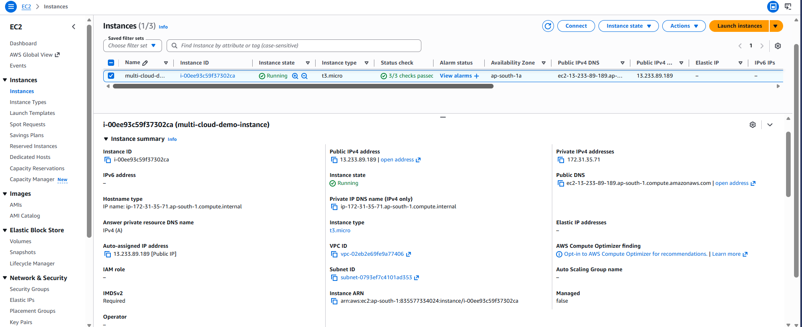
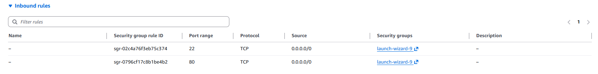
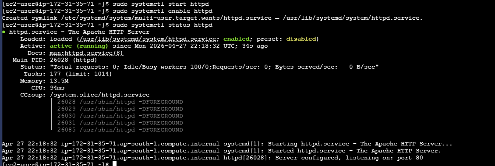
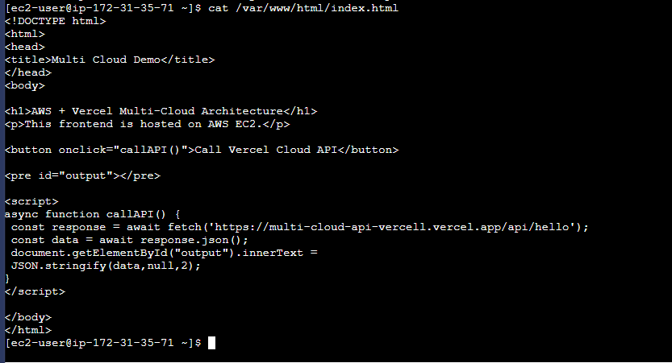
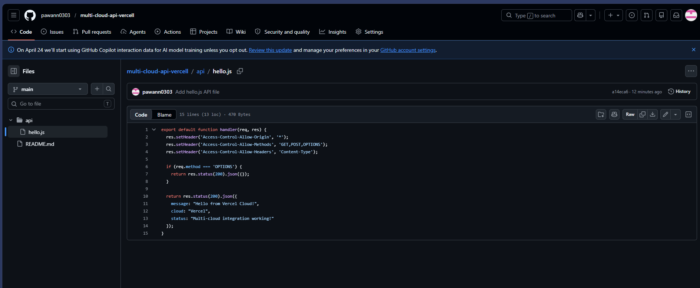
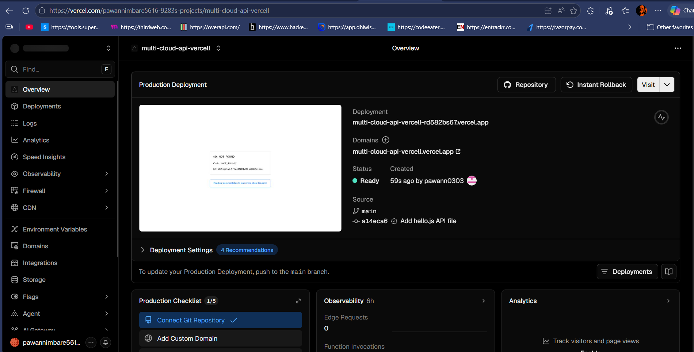
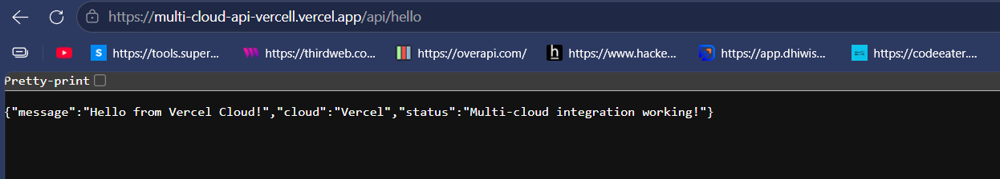
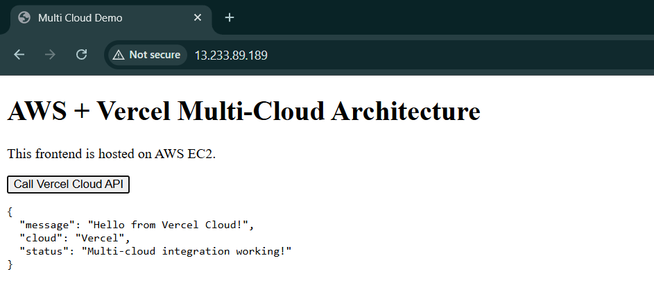

# Task 3: Multi-Cloud Architecture using AWS and Vercel

## 📌 Objective

To design and implement a multi-cloud architecture where application services are distributed across two cloud platforms and demonstrate interoperability between them.

---

## ☁️ Cloud Platforms Used

* **Cloud Provider 1:** Amazon Web Services (AWS)
* **Cloud Provider 2:** Vercel (Serverless Cloud Platform)

---

## 🏗️ Architecture Overview

In this implementation:

* The **frontend** is hosted on an AWS EC2 instance using Apache.
* The **backend** is implemented as a serverless function on Vercel.
* The AWS frontend communicates with the Vercel backend through HTTP API calls.

---

## 🛠️ Implementation Details

### 1️⃣ EC2 Instance Setup (AWS)

An EC2 instance was launched using AWS Free Tier to host the frontend application.

📷 Screenshot:


---

### 2️⃣ Security Group Configuration

Inbound rules were configured to allow:

* HTTP (Port 80)
* SSH (Port 22)

📷 Screenshot:


---

### 3️⃣ Apache Web Server Setup

Apache was installed and verified using:

```bash
sudo systemctl status httpd
```

📷 Screenshot:


---

### 4️⃣ Frontend Code on AWS

The frontend HTML file was created on EC2 and includes JavaScript code to call the Vercel API.

```bash
cat /var/www/html/index.html
```

📷 Screenshot:


---

### 5️⃣ Backend Serverless Function (Vercel)

A serverless function (`hello.js`) was created on Vercel to return a JSON response. CORS was enabled for cross-cloud communication.

📷 Screenshot:


---

### 6️⃣ Vercel Deployment

The backend was deployed successfully on Vercel, generating a public API endpoint.

📷 Screenshot:


---

### 7️⃣ API Output

The Vercel API endpoint was tested and returned the expected JSON response.

📷 Screenshot:


---

### 8️⃣ Final Multi-Cloud Integration

The AWS EC2 public IP was accessed via browser. On clicking the button, the frontend sent a request to the Vercel backend and displayed the response.

📷 Screenshot:


---

## 🔄 Workflow Summary

1. User accesses frontend hosted on AWS EC2
2. Frontend sends HTTP request to Vercel API
3. Vercel processes request and returns JSON response
4. Response is displayed on AWS webpage

---

## 📊 Results

The multi-cloud architecture was successfully implemented. AWS and Vercel communicated seamlessly, demonstrating real-time interoperability.

---

## ✅ Conclusion

This task demonstrated a real-world implementation of multi-cloud architecture using AWS and Vercel. By distributing services across platforms, the system achieved flexibility, scalability, and better resource utilization.
